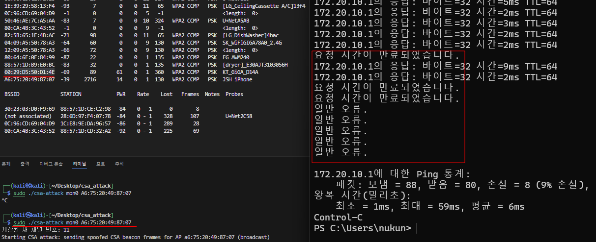

# CSA (Channel Switch Attack) Tool

WiFi 네트워크의 비컨 프레임을 조작하여 채널 스위치 공격을 수행하는 도구입니다.

## 개요

이 도구는 특정 WiFi AP(Access Point)의 비컨 프레임을 캡처하고, CSA(Channel Switch Announcement) IE를 삽입하여 클라이언트를 다른 채널로 강제 이동시키는 공격을 수행합니다.

## 기능

- WiFi 인터페이스를 통한 비컨 프레임 캡처
- CSA IE 삽입을 통한 채널 스위치 공격
- 브로드캐스트 또는 특정 클라이언트 대상 공격 지원
- 자동 채널 계산 (1 ↔ 11, 6 → 11, 기타 채널은 +6 이동)

## 요구사항

- Linux 운영체제
- libpcap 라이브러리
- C++ 11 이상의 컴파일러

## 빌드 방법

```bash
make
./csa-attack <interface> <ap_mac> [<station_mac>]
```

- interface: 모니터 모드로 설정된 WiFi 인터페이스 이름
- ap_mac: 대상 AP의 MAC 주소 (xx:xx:xx:xx:xx:xx 형식)
- station_mac: (선택사항) 특정 클라이언트의 MAC 주소

## 설명

이 프로젝트는 크게 아래와 같은 구성 요소로 이루어져 있습니다:

1. [`PcapHandler`](pcap_handler.h) - 패킷 캡처 및 전송을 담당
2. [`CSAAttack`](csa_attack.h) - CSA IE 조작 및 채널 계산 로직
3. [`main.cpp`](main.cpp) - 프로그램의 진입점 및 전체 공격 흐름 제어

## 시연 내용

